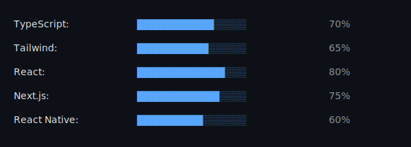
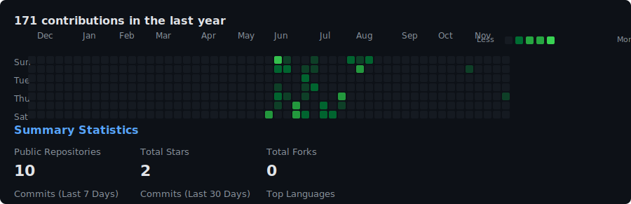

# Hi, I'm Shawn 👋

### Developer & Creator

---

## 🛠️ Tech Stack

---

## 📊 GitHub Contributions

---

## 💻 About Me

- 🔭 I'm currently working on exciting projects
- 🌱 I'm continuously learning and improving
- 👯 I'm open to collaborating on interesting projects
- 💬 Ask me about React, Next.js, TypeScript, and modern web development
- 📫 How to reach me: [GitHub Profile](https://github.com/ShawnBrownDev)

---

## 📈 GitHub Stats

---

  
### ⭐ Check out my repositories

